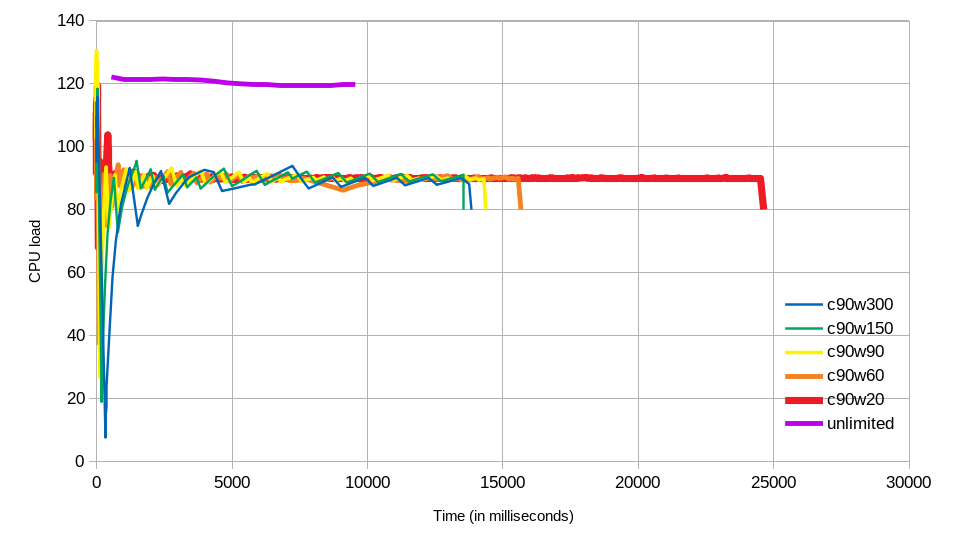

# pull-drain-gently

> Like `pull.drain`, but this respects CPU usage, attempting to stay below a prescribed limit

```bash
npm install --save pull-drain-gently
```

## Usage

### Default use

```js
const pull = require('pull-stream');
const drainGently = require('pull-drain-gently');

pull(
  pull.count(1000000),
  drainGently(x => console.log(x), () => console.log('done')),
);
```

### Tweaking the parameters

This pull-stream sink pulls from the source, but once in a while it will check the CPU usage, and if it has gone above the limit known as the `ceiling`, it pauses draining for `wait` milliseconds, and then resumes, in such a way that it should stay close to the limit. In other words, two parameters control the draining:

- `ceiling`: the maximum CPU usage you want this draining sink to consume, approximately, in percentages (`100` is 100%, not `1`)
- `wait`: the waiting period, in milliseconds, to pause draining in order to allow other tasks to use the CPU

The default CPU ceiling is `88%` and the default waiting period for each pause is `144ms` (roughly 9 frames if you have the UI running at 60fps). This means that the longest pause during which no drains will occur is 144ms.

There is also a third less common parameter, which by default is turned off:

- `maxPause`: a limit in milliseconds for how long to pause between draining. For instance, when `maxPause = 5000`, the draining will remain paused for 5 seconds maximum, after that it will d resume draining *regardless* of the current CPU usage. **The default is `Infinity`**.

To configure your own parameters, pass an `opts` object as the first argument, where **both** ceiling and wait must be defined:

```js
const pull = require('pull-stream');
const drainGently = require('pull-drain-gently');

pull(
  pull.count(1000000),
  drainGently(
    {ceiling: 90, wait: 60}, // <--- opts
    x => console.log(x),
    () => console.log('done'),
  ),
);
```

To configure these parameters, consider that:

- The **greater the `ceiling`** is, the closer this sink behaves to stock `pull.drain`, i.e. the *less gently* it drains with regards to CPU load
- The **smaller the `ceiling`** is, the more time it will take to consume the source, i.e. the slower your application will run overall
- The **greater the `wait`**, the more the actual CPU usage fluctuates below and above the `ceiling`, i.e. the more bumpy the ride is for CPU usage and workload throughput
- The **smaller the `wait`**, the more the actual CPU usage accurately meets the `ceiling`, but also the more overhead there is with many short-lived timers for those pauses

The total time for drainage is also important. `pull.drain` is the fastest, having the shortest total time. `drainGently` with a small `wait` might give a total drainage time of approx. 2.5x that of `pull.drain`.

The defaults `ceiling=88`, `wait=144` are a sweet spot, and it can achieve a total drainage time of approx 1.4x that of `pull.drain`. You can run benchmarks yourself by running `cd perf && ./run-all.sh` in this repository.

The chart below shows results for running the benchmark in `perf` on Ubuntu 18.04.3 x86_64, Intel® Core™ i7-7500U CPU @ 2.70GHz × 4, 15,4 GiB RAM, for different values of ceiling (`c`) and wait (`w`). "Unlimited" means `pull.drain`:



## License

[MIT](https://tldrlegal.com/license/mit-license)
